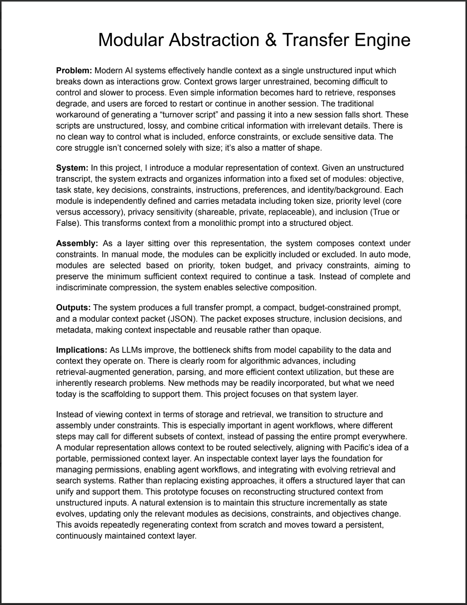

# Modular Context Abstraction & Transfer Engine

A Streamlit prototype for transforming long AI collaboration transcripts into
modular, reusable context packets for LLM workflows.

## Project Overview



[View Full One-Pager (PDF)](./one-pager.pdf)

The tool extracts important working context into modules, labels each module by
privacy level, estimates token cost, and assembles transfer prompts that fit a
target budget.

## Why This Project Matters

Long AI-assisted projects often fail at handoff time: the useful context is
buried across a full chat transcript, mixed with private details, stale
branches, and low-value chatter. This project explores a more explicit context
layer.

It converts unstructured transcripts into:

- Current objective
- Task/project state
- Key decisions
- Constraints
- Instructions and preferences
- Identity/background context that can be excluded by default

## Features

- Paste or upload a `.txt` / `.md` transcript.
- Extract structured context modules with the OpenAI API.
- Estimate token cost for each module.
- Mark modules as shareable, replaceable, or private.
- Assemble a transfer prompt manually or with automatic budget-aware selection.
- Download the final prompt for use in another AI session.

## Tech Stack

- Python
- Streamlit
- OpenAI API
- `tiktoken` for token estimation

## Quick Start

```bash
python -m venv .venv
source .venv/bin/activate
pip install -r requirements.txt
cp .env.example .env
```

Add your API key:

```bash
OPENAI_API_KEY=your_api_key_here
```

Run the app:

```bash
streamlit run app.py
```

## Testing

```bash
python test_extraction.py
```

## Status

Prototype. The core extraction and prompt assembly loop is working, but this is
intended as an exploration of context engineering rather than a production SaaS
app.
